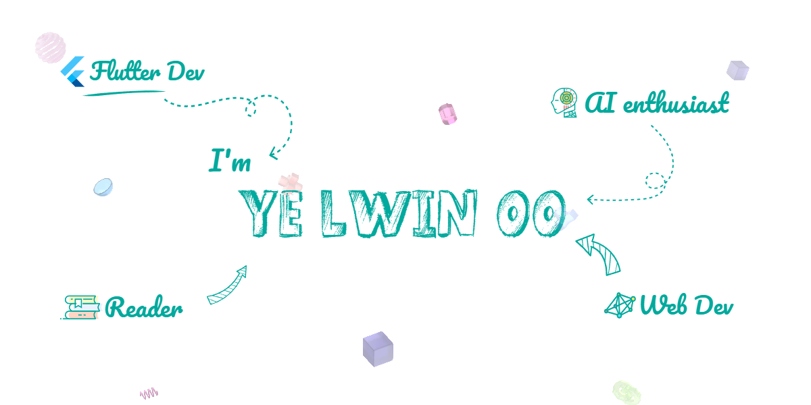

  

 
 

 &nbsp;
 &nbsp;
 &nbsp;
 &nbsp; 

# <b style="font-size: 50px">👋</b> &nbsp;<b>Hi There!</b>

<h3>I'm <b style="color: #0ca4a5">a passionate Software developer ( also a CDM Student ) </b> from Myanmar.</h3> 
<ul>
<li> 🔭  I'm currently working as <b style="font-size: 16px;color: #0ca4a5;">a Flutter developer at <a href="https://app.com.mm">App.com.mm</a></b>.</li>
<li> 📖  I am also a novice AI Engineer & avid reader. </li>
<li> 💭  I love solving programming challenges, coding and building various software projects with Dart & Flutter. </li>
<li> 🕸  Slightly obsessed with Web technologies.</li> 
<li> 📮  I often work on <b>freelance projects</b>. Contact me via <a href="mailto: yelwinoo.work@gmail.com">yelwinoo.work@gmail.com</a> .</li>

&nbsp;

## 💻 &nbsp;My Skills & Tools

 &nbsp;
 &nbsp;
 &nbsp;
 &nbsp;
 &nbsp;
  

### 🚀 &nbsp; Minor skills

 &nbsp;
 &nbsp;
 &nbsp;
 &nbsp;

&nbsp;

## 📃 &nbsp;My Showcase Projects

 

&nbsp; 

 &nbsp; 
 

&nbsp;

## 📊 &nbsp;Stats

 &nbsp;
