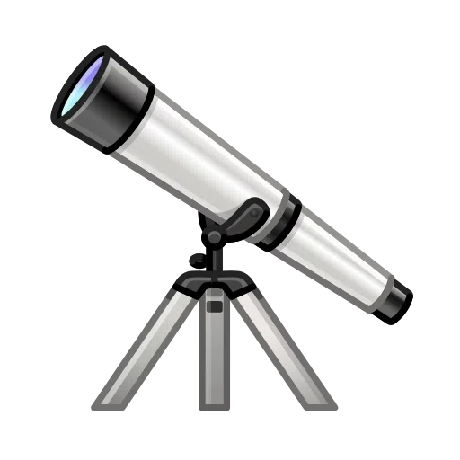

 &nbsp;
 &nbsp;
 &nbsp;

##  &nbsp;<b>Hi There! I'm Ye Lwin Oo (Steve)</b>
<h4>Mobile developer with 5+ years of experience building cross-platform apps — focusing on sleek UI, real-time features, and immersive user experiences. Lately diving into performance tuning, animation, and AI-driven app flows.</h4>
<ul>
<li>   I'm currently contributing <a href="https://en.wikipedia.org/wiki/Open_source">open source projects</a> using Flutter.</li>
<li>   I love solving programming challenges, coding and building various software projects.
</li>
<li>&nbsp; Fairly obsessed with Web technologies ( <a href="https://witaward.com/result/2020">WIT Web Design Award Winner 2020</a> ).</li>
<li>&nbsp; On a mission to fix bugs I proudly introduced.</li>
<li>  Contact me via <a href="mailto: yelwinoo.work@gmail.com">yelwinoo.work@gmail.com</a> .</li>

## &nbsp;Love my works?

&nbsp;[Check out my portfolio](https://yl0.me) 
&nbsp;[Read my blogs](https://blog.yl0.me/) 
 [Buy me a coffee](https://buymeacoffee.com/yloo2) ( My productivity runs on Cappuccino )

##  &nbsp;Github Stats

&nbsp;&nbsp;
&nbsp;

